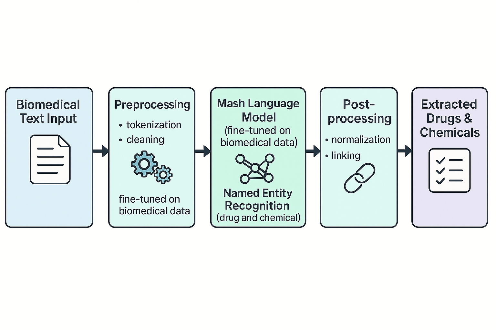

# Synergizing Domain-Specific Masked Language Models and Instruction-Tuned LLMs for Chemical NER


This repository contains the official implementation of the paper **"Synergizing Domain-Specific Masked Language Models and Instruction-Tuned LLMs for Chemical NER"**, submitted to LREC 2026.

The framework implements a robust two-stage Chemical Named Entity Recognition (NER) system:
1.  **Supervised Fine-tuning:** Optimization of domain-specific MLMs (BioBERT) using automated hyperparameter tuning (Optuna).
2.  **Generative Tagging with Guidance:** A novel pipeline where instruction-tuned LLMs (Mistral, LLaMA, DeepSeek) generate BIO tags, guided by weak supervision from the specialized MLM.


### Hardware
* **GPU:** NVIDIA GPU with at least 16GB VRAM (24GB+ recommended for training).
    * *Tested on:* **2x NVIDIA RTX A6000 (48GB each)**
* **RAM:** 32GB+ System RAM

# Requirements
* **Python:** 3.12.0
* **Transformers:** 4.45.2
* **Datasets:** 3.4.1
* **PyTorch:** Compatible with CUDA 11.8/12.x
* **Seqeval:** For evaluation metrics

Install dependencies via pip:

```bash
pip install torch transformers datasets pandas scikit-learn seqeval tqdm

## Data Format

### 1. NER Training Data (TSV)
The training scripts expect data in standard **CoNLL-2003** format (token-per-line).
* Columns: `Token` `Label`
* Labels: `B`, `I`, `O`

**Example (`train.tsv`):**
```tsv
Aspirin   B
is        O
used      O
for       O
pain      O
.         O

For the reproducibility of this code run this code.

# **Supervised Fine-tuning:**

CUDA_VISIBLE_DEVICES=0,1,... python finetuned_biobert_args.py \
    --train_file `TrainPath` \
    --dev_file `DevPath` \
    --test_file `TestPath` \
    --output_dir `OutputFolder`

### Example

CUDA_VISIBLE_DEVICES=0 python finetuned_biobert_args.py \
    --train_file /combined_chem_train.tsv \
    --dev_file /combined_chem_dev.tsv \
    --test_file /biored_chem_test_iob.tsv \
    --output_dir biobert_biored
```

### **Generative Tagging with Guidance:**
```
python llm_guided_biobert.py \
    --train_file "path/to/train.tsv" \
    --dev_file "path/to/dev.tsv" \
    --test_file "path/to/test.tsv" \
    --output_dir "./output_model" \
    --llm_model "epfl-llm/meditron-7b"

```

### ***Information about the finedtuned models : ***
The funetuned models (MLMs and LLMs) are uploaded on huggingface repository:
- `anonymous-research-2026/BioBert`